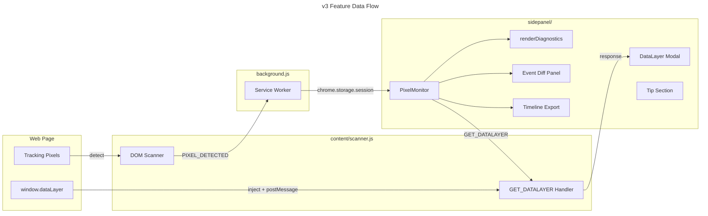
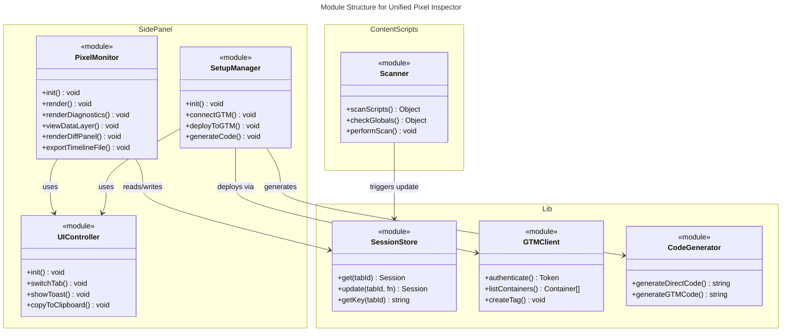

# C4 Code Level: Unified Pixel Inspector v3

## Overview
- **Name**: Unified Pixel Inspector v3.0.0
- **Description**: Chrome extension that detects, diagnoses, and helps set up tracking pixels across Meta, TikTok, Google/GTM, GA4, Zalo
- **Location**: `c:\Users\PC\.gemini\antigravity\scratch\unified-pixel-inspector\`
- **Language**: JavaScript (ES Modules), HTML, CSS
- **Purpose**: Debug tracking pixels, generate event code, deploy to GTM — all from Chrome's side panel

---

## Code Elements

### `sidepanel/modules/PixelMonitor.js` — Core Monitor

| Method | Signature | Description |
|--------|-----------|-------------|
| `constructor(ui)` | `(UIController) → void` | Initializes session, filters, dashboardUrls, platformNames, diff state, `_eventsBound` guard |
| `init()` | `async () → void` | Gets active tab, loads session. **Binds events only once** via `_eventsBound` flag |
| `bindEvents()` | `() → void` | Binds all UI events via delegated listeners. Runs exactly once per lifecycle |
| `render()` | `() → void` | Calls renderPlatforms → renderDiagnostics → renderTimeline → renderCaptureState |
| `renderPlatforms()` | `() → void` | Renders platform cards with copy-ID `📋` buttons and dashboard `🔗` links |
| `renderDiagnostics()` | `() → void` | **7 health checks** with icons and platform-specific tips |
| `viewDataLayer()` | `async () → void` | Sends `GET_DATALAYER` to content script, opens modal |
| `showDataLayerModal(dl)` | `(Array) → void` | Renders accordion list in modal overlay, auto-opens last 3 entries |
| `renderTimeline()` | `() → void` | Event list with diff checkboxes, shows diff panel when 2 selected |
| `handleDiffCheckbox(cb)` | `(HTMLInputElement) → void` | Manages diff selection (max 2, oldest auto-deselected) |
| `renderDiffPanel(events)` | `(Array) → void` | Comparison table with highlighted parameter differences |
| `exportTimelineFile()` | `() → void` | Downloads events as JSON file with url + timestamp metadata |
| `exportText()` | `() → void` | Rich text report with platforms + events → clipboard |
| `exportJson()` | `() → void` | Copies session JSON to clipboard, falls back to download |
| `downloadFile(c,f,t)` | `(string, string, string) → void` | Generic Blob download helper |

### `sidepanel/modules/UIController.js` — UI Management

| Method | Signature | Description |
|--------|-----------|-------------|
| `init()` | `() → void` | Loads saved theme, binds tab/theme events |
| `switchTab(tabId)` | `(string) → void` | Switches active tab |
| `showToast(msg, type)` | `(string, string) → void` | Shows notification toast |
| `copyToClipboard(text)` | `async (string) → void` | Copies text, shows toast |

### `sidepanel/modules/SetupManager.js` — Setup Wizard

| Method | Signature | Description |
|--------|-----------|-------------|
| `init()` | `() → void` | Renders action grid, binds events, loads pixel IDs |
| `connectGTM()` | `async () → void` | OAuth2 authentication flow |
| `deployToGTM()` | `async () → void` | Builds tags/triggers, deploys via GTM API |
| `generateCode()` | `() → void` | Generates direct/GTM code for selected platforms |
| `autoDetectFromSession()` | `async () → void` | Auto-fills pixel IDs from scan results |

### `content/scanner.js` — DOM Scanner + DataLayer Bridge

| Function | Description |
|----------|-------------|
| `scanScripts()` | Scans `<script>` tags for pixel patterns (Meta, TikTok, Google, Zalo) |
| `checkGlobals()` | Checks `window.fbq`, `window.ttq`, `window.dataLayer`, `window.ZaloSocialSDK` |
| `scanZaloWidget()` | Scans DOM elements for Zalo widget `data-oaid` attributes |
| `performScan()` | Merges all detections, sends `PIXEL_DETECTED` to background |
| `GET_DATALAYER handler` | Injects page script to read `window.dataLayer` → `postMessage` → `sendResponse` |

---

## Diagnostics Logic (7 Checks)

| # | Check | Type | Condition | Tip |
|---|-------|------|-----------|-----|
| 1 | Duplicate IDs | 🔴 Error | `pixelIds.length > 1` | Xóa ID thừa |
| 2 | Not initialized | ⚠️ Warning | `installed && !loaded && !fired` | Check init code |
| 3 | Not firing | ⚠️ Warning | `loaded && !fired` | Interact with page |
| 4 | Network-only | ℹ️ Info | `installed && !loaded && fired` | Platform-specific globalVar check |
| 5 | Session errors | 🔴 Error | `data.errors[]` | Forward from hooks |
| 6 | Missing value | 💰 Warning | Ecommerce event without `value` param | Add value & currency |
| 7 | No platforms | 🔍 Info | `platforms === {}` | Open page with pixels |

---

## Data Flow

## Module Dependencies

## Key Bugfixes in v3.0.0

| Bug | Root Cause | Fix |
|-----|------------|-----|
| Dashboard opens 4 tabs | `document.addEventListener('click')` registered on every `init()` call | Added `_eventsBound` flag — events bound exactly once |
| Generic async diagnostic | "Pixel có thể load bất đồng bộ" unhelpful | Platform-specific message with globalVar name + Network tab filter tip |
| Missing QR donate | Buy Me A Coffee link only | Replaced with QR code image (`icons/qr-donate.png`) |

## Dependencies

### Internal
- `lib/sessionStore.js` — Session storage wrapper (chrome.storage.session)
- `lib/eventMapping.js` — Event dictionary (ecommerce, general, custom)
- `lib/codeGenerator.js` — Platform-specific code generation
- `lib/gtmClient.js` — GTM API client (OAuth2, CRUD)
- `lib/gtmTagBuilder.js` — GTM tag/trigger payload builder
- `content/hooks.js` — Page-injected hooks for intercepting pixel calls

### External
- Chrome Extensions API (tabs, storage, identity, sidePanel, webRequest)
- Google Tag Manager API v2
- Google OAuth2

## Notes
- All features are **free**. Tip section is voluntary.
- DataLayer inspection requires injecting a `<script>` to escape content script isolation.
- Event diff auto-deselects oldest when 3rd event is checked.
- `_eventsBound` pattern prevents listener accumulation across refresh cycles.
