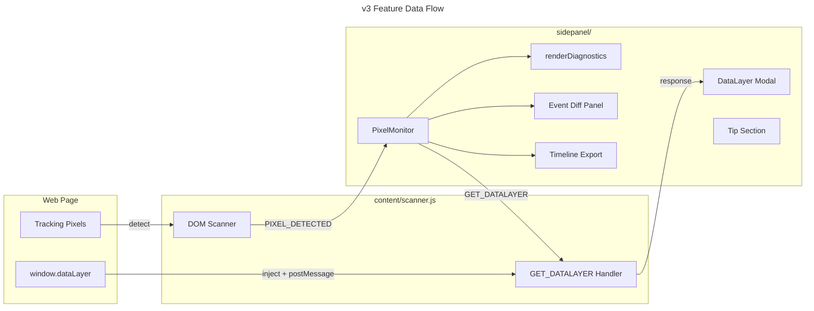

# C4 Code Level: Unified Pixel Inspector v3

## Overview
- **Name**: Unified Pixel Inspector v3
- **Description**: Chrome extension that detects, diagnoses, and helps set up tracking pixels across Meta, TikTok, Google/GTM, GA4, Zalo
- **Location**: `c:\Users\PC\.gemini\antigravity\scratch\unified-pixel-inspector\`
- **Language**: JavaScript (ES Modules), HTML, CSS
- **Purpose**: Debug tracking pixels, generate event code, deploy to GTM — all from Chrome's side panel

---

## Module Structure

### `sidepanel/modules/PixelMonitor.js`
**The core monitor — handles detection display, diagnostics, timeline, and export.**

| Method | Signature | Description |
|--------|-----------|-------------|
| `constructor(ui)` | `(UIController) → void` | Initializes session, filters, dashboardUrls, platformNames, diff state |
| `init()` | `async () → void` | Gets active tab, loads session, binds reactive storage listener |
| `bindEvents()` | `() → void` | Binds all UI events: capture, clear, filters, export, dataLayer, diff, dashboard, copy |
| `render()` | `() → void` | Calls renderPlatforms → renderDiagnostics → renderTimeline → renderCaptureState |
| `renderPlatforms()` | `() → void` | Renders platform cards with copy-ID buttons and dashboard links |
| `renderDiagnostics()` | `() → void` | **v3 Enhanced**: 7 diagnostic checks with icons and actionable tips |
| `viewDataLayer()` | `async () → void` | **v3 New**: Sends GET_DATALAYER to content script, opens modal |
| `showDataLayerModal(dataLayer)` | `(Array) → void` | **v3 New**: Renders accordion list in modal overlay |
| `renderTimeline()` | `() → void` | **v3 Enhanced**: Adds diff checkboxes, shows diff panel when 2 selected |
| `handleDiffCheckbox(checkbox)` | `(HTMLInputElement) → void` | **v3 New**: Manages diff selection (max 2) |
| `renderDiffPanel(events)` | `(Array) → void` | **v3 New**: Comparison table with highlighted differences |
| `exportTimelineFile()` | `() → void` | **v3 New**: Downloads events as JSON with metadata |
| `exportText()` | `() → void` | **v3 Enhanced**: Rich text report with platforms + events |
| `exportJson()` | `() → void` | **v3 Enhanced**: Copies to clipboard first, falls back to download |

### `sidepanel/modules/UIController.js`
**Theme management, tab switching, toast notifications, clipboard.**

| Method | Signature | Description |
|--------|-----------|-------------|
| `init()` | `() → void` | Loads theme, binds events |
| `switchTab(tabId)` | `(string) → void` | Switches active tab |
| `showToast(message, type)` | `(string, string) → void` | Shows notification toast |
| `copyToClipboard(text)` | `async (string) → void` | Copies text, shows toast |

### `sidepanel/modules/SetupManager.js`
**Setup wizard for generating pixel code + deploying to GTM.**

| Method | Signature | Description |
|--------|-----------|-------------|
| `init()` | `() → void` | Renders action grid, binds events, loads pixel IDs |
| `connectGTM()` | `async () → void` | OAuth2 authentication flow |
| `deployToGTM()` | `async () → void` | Builds tags/triggers, deploys via API |
| `generateCode()` | `() → void` | Generates direct/GTM code for selected platforms |
| `autoDetectFromSession()` | `async () → void` | Auto-fills pixel IDs from scan results |

### `content/scanner.js`
**Content script injected into every page — scans DOM for tracking pixels.**

| Function | Description |
|----------|-------------|
| `scanScripts()` | Scans `<script>` tags for pixel patterns |
| `checkGlobals()` | Checks `window.fbq`, `window.ttq`, etc. |
| `scanZaloWidget()` | Scans DOM for Zalo widget `data-oaid` |
| `performScan()` | Merges all detections, sends to background |
| `GET_DATALAYER handler` | **v3 New**: Injects page script to read `window.dataLayer`, returns via sendResponse |

---

## v3 Features Data Flow

## Dependencies

### Internal
- `lib/sessionStore.js` — Session storage wrapper (chrome.storage.session)
- `lib/eventMapping.js` — Event dictionary (ecommerce, general, custom)
- `lib/codeGenerator.js` — Platform-specific code generation
- `lib/gtmClient.js` — GTM API client (OAuth2, CRUD)
- `lib/gtmTagBuilder.js` — GTM tag/trigger payload builder
- `content/hooks.js` — Page-injected hooks for intercepting pixel calls

### External
- Chrome Extensions API (tabs, storage, identity, sidePanel, webRequest)
- Google Tag Manager API v2
- Google OAuth2

## Notes
- All features are **free**. Tip section is voluntary.
- DataLayer inspection requires injecting a `<script>` to escape content script isolation.
- Event diff auto-deselects oldest when 3rd event is checked.
